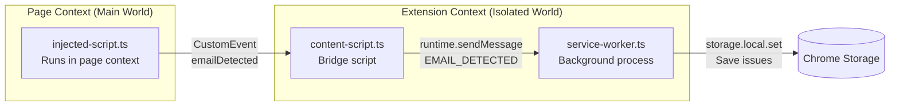
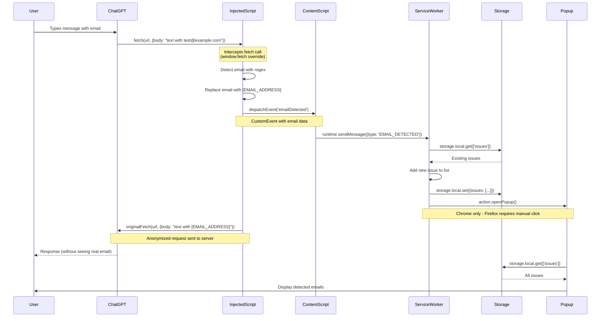
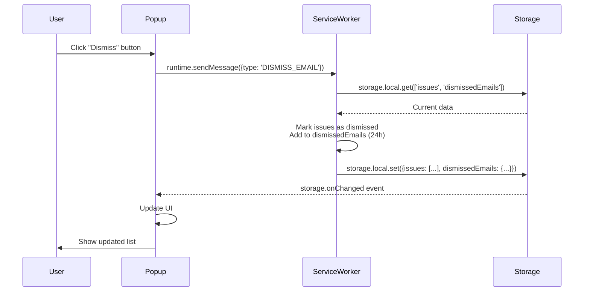
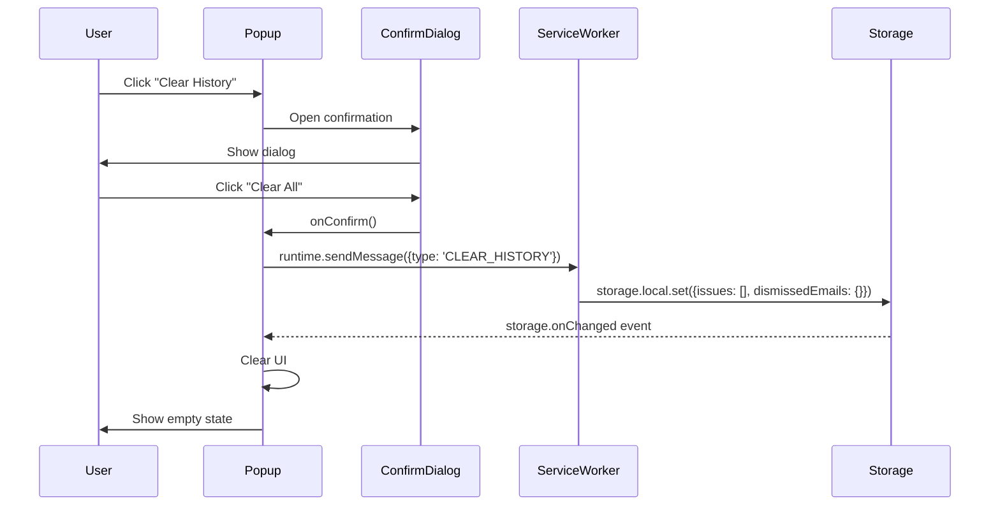

# Prompt Monitoring Browser Extension

A browser extension that monitors ChatGPT prompts for email addresses, automatically anonymizes them, and provides a comprehensive tracking interface.

## Features

### Core Functionality
- Real-time email detection in ChatGPT prompts using regex
- Automatic anonymization of detected email addresses with `[EMAIL_ADDRESS]`
- Instant popup notification when emails are detected
- Persistent storage of all detected emails in browser local storage

### User Interface
- **Issues Found Tab**: View currently active email detections
- **History Tab**: Browse all previously detected emails
- Material-UI based, clean interface
- Email grouping with detection count

### Email Dismiss System
- Dismiss individual email addresses for 24 hours
- Auto-dismiss during 24-hour period (no repeated alerts)
- Visual "Dismissed" badge in history

## Browser Compatibility

### Fully Supported Browsers
- **Google Chrome** (v109+)
- **Microsoft Edge** (Chromium-based, v109+)
- **Brave Browser** (Chromium-based)
- **Opera** (Chromium-based)
- **Mozilla Firefox** (v109+)

### How It Works
- Uses `webextension-polyfill` for cross-browser API compatibility
- **Two build targets** due to Manifest V3 differences:
  - `npm run build:chrome` - For Chromium browsers (service_worker)
  - `npm run build:firefox` - For Firefox (background scripts)
- Promise-based API (async/await pattern)

### Why Two Builds?
Firefox MV3 support for `service_worker` is still experimental. Current Firefox versions require `background.scripts` instead of `background.service_worker`, while Chromium browsers require the opposite. This is a temporary limitation until Firefox fully implements MV3 service workers.

### Not Supported
- **Safari**: Requires significant additional development due to:
  - Incomplete Manifest V3 implementation  
  - Xcode conversion & macOS development environment required
  - Different service worker architecture

## Installation

### Prerequisites
- Node.js (v14 or higher)
- npm
- One of the supported browsers (Chrome, Edge, Firefox, Brave, Opera)

### Build Instructions

1. **Clone or extract the project**
2. **Install dependencies**
   ```bash
   npm install
   ```

3. **Build the extension**
   
   **Build for all browsers (recommended):**
   ```bash
   npm run build
   ```
   Creates two folders:
   - `dist-chrome/` - For Chrome/Edge/Brave/Opera
   - `dist-firefox/` - For Firefox
   
   **Or build individually:**
   ```bash
   npm run build:chrome    # Creates dist-chrome/
   npm run build:firefox   # Creates dist-firefox/
   ```
   
   **Note:** Firefox and Chrome require different manifest configurations:
   - Chrome uses `background.service_worker` (MV3)
   - Firefox uses `background.scripts` (MV3 with compatibility)

4. **Load the extension**

   **For Chrome/Edge/Brave/Opera:**
   - Open browser and navigate to:
     - Chrome: `chrome://extensions/`
     - Edge: `edge://extensions/`
     - Brave: `brave://extensions/`
     - Opera: `opera://extensions/`
   - Enable "Developer mode" (top right toggle)
   - Load unpacked
   - Select the `dist-chrome/` folder

   **For Firefox:**
   - Open Firefox and navigate to `about:debugging#/runtime/this-firefox`
   - Load Temporary Add-on
   - Navigate to `dist-firefox/` folder and select `manifest.json`

5. **Test the extension**
   - Navigate to ChatGPT
   - Send a message containing an email address (e.g., `test@example.com`)
   - The extension popup should open automatically (Chrome/Edge) or can be clicked manually (Firefox)
   - Check that the email was anonymized in the actual request

## Technical Implementation

### Architecture Overview



**Key Points:**
- **injected-script.ts**: Overrides `window.fetch`, detects and anonymizes emails
- **content-script.ts**: Bridges page context to extension APIs
- **service-worker.ts**: Handles business logic and data persistence

### Why Injected Script?

The assignment specifies using the service worker for scanning. However, Chrome Manifest V3 has strict limitations:

**Official Chrome Documentation Confirms:**

1. **chrome.webRequest** - "mostly READ-ONLY in Manifest V3"
   - Can observe requests
   - Cannot modify request body
   
2. **chrome.declarativeNetRequest** - Static rules only
   - Cannot access or modify request payload
   - Cannot perform dynamic content inspection

3. **Our Solution: Injected Script Pattern**
   - Override window.fetch in main world context
   - Intercept and modify request body before send
   - Industry standard for MV3 request modification

**Source:** Chrome Extension Developer Documentation
- chrome.webRequest: https://developer.chrome.com/docs/extensions/reference/webRequest/
- Manifest V3 Migration: https://developer.chrome.com/docs/extensions/migrating/

This approach is not a workaround—it's the recommended pattern for extensions that need to modify network requests in MV3.

### Email Detection Flow



**Why This Works:**
- Injected script runs in main world and can override `window.fetch`
- Has access to request body before it's sent
- Can modify payload dynamically
- Content script bridges to extension APIs
- Service worker manages data persistence
- Server receives only anonymized data

**Official Sources:**
- [Chrome Content Scripts Documentation](https://developer.chrome.com/docs/extensions/mv3/content_scripts/)
- [Manifest V3 Migration - webRequest Changes](https://developer.chrome.com/docs/extensions/migrating/)
- [Stack Overflow: Manifest V3 Fetch Interception](https://stackoverflow.com/questions/tagged/chrome-extension+manifest-v3+fetch)

This approach is **not a workaround**—it's the **recommended pattern** for extensions that need to modify network requests in Manifest V3.

## User Interaction Flows

### Dismiss Email Flow



### Clear History Flow



## Testing

### Manual Testing Checklist

1. **Email Detection**
   - Send a ChatGPT prompt with `test@example.com`
   - Verify popup opens automatically (Chrome/Edge) or manually click extension icon (Firefox)
   - Check email appears in "Issues Found"
   - Verify email was replaced with `[EMAIL_ADDRESS]` in request (check Network tab)

2. **Dismiss Functionality**
   - Click "Dismiss" on an email
   - Verify it disappears from "Issues Found"
   - Send same email again within 24h
   - Verify no popup opens (auto-dismissed)
   - Check "History" tab shows "Dismissed" badge

3. **History Tab**
   - Navigate to "History" tab
   - Verify all detections are listed (newest first)
   - Check timestamps are correct
   - Dismissed items should show badge

4. **Clear History**
   - Click "Clear History" button
   - Confirm in dialog
   - Verify all issues are removed
   - Check that dismissed state is also cleared

5. **Multiple Emails**
   - Send prompt with multiple emails: `test1@example.com and test2@example.com`
   - Verify both are detected
   - Check both are anonymized
   - Verify grouped display in Issues tab

6. **Cross-Browser Testing**
   - Test on Chrome (latest)
   - Test on Firefox (latest)
   - Test on Edge (latest)
   - Verify identical functionality

## Tech Stack

- **Frontend**: React 18, TypeScript, Material-UI
- **State Management**: Context API
- **Build Tool**: Webpack 5
- **Extension APIs**: chrome.* / browser.* (webextension-polyfill)
- **Storage**: chrome.storage.local
- **Styling**: Material-UI + Custom CSS

## Development

### Available Scripts

```bash
npm run build           # Build for both Chrome and Firefox
npm run build:chrome    # Build for Chrome/Edge/Brave/Opera
npm run build:firefox   # Build for Firefox
npm run dev:chrome      # Development mode with watch (Chrome)
npm run dev:firefox     # Development mode with watch (Firefox)
npm run type-check      # Run TypeScript type checking
```

### Development Workflow

1. Make changes to source files in `src/`
2. Run `npm run build:chrome` or `npm run build:firefox`
3. Reload extension in browser
4. Refresh ChatGPT page
5. Test changes

For active development, use:
```bash
npm run dev:chrome    # Auto-rebuild on file changes
```

## Project Structure

```
prompt-monitoring-extension/
├── public/
│   ├── manifest.chrome.json    # Chrome/Edge/Brave/Opera manifest
│   ├── manifest.firefox.json   # Firefox manifest  
│   └── popup.html              # Popup HTML template
├── src/
│   ├── background/
│   │   └── service-worker.ts   # Background service worker
│   ├── content/
│   │   ├── content-script.ts   # Content script (isolated world)
│   │   └── injected-script.ts  # Injected script (main world)
│   ├── popup/
│   │   ├── components/         # React components
│   │   ├── context/            # React Context
│   │   ├── App.tsx             # Main app component
│   │   ├── App.css             # Global styles
│   │   ├── index.tsx           # Entry point
│   │   └── theme.ts            # Material-UI theme
│   ├── types/                  # TypeScript interfaces
│   ├── constants/              # Application constants
│   └── utils/                  # Utility functions
├── dist-chrome/                # Chrome build output
└── dist-firefox/               # Firefox build output
```